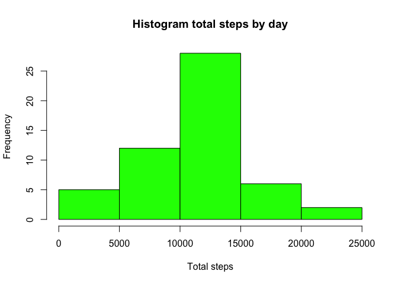
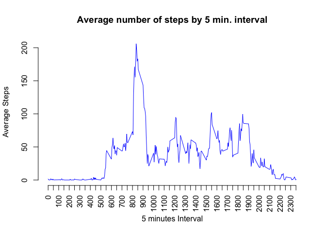

## Load & process data
First load data into `activity` variable

```r
activity <- read.csv("~/RepData_PeerAssessment1/activity.csv")
```

Check for correct class of variables

```r
str(activity)
```

```
## 'data.frame':	17568 obs. of  3 variables:
##  $ steps   : int  NA NA NA NA NA NA NA NA NA NA ...
##  $ date    : chr  "2012-10-01" "2012-10-01" "2012-10-01" "2012-10-01" ...
##  $ interval: int  0 5 10 15 20 25 30 35 40 45 ...
```

`date` variable has class character, and it has to be "Date".

```r
activity$date <- as.Date(activity$date)
```

Check again

```r
str(activity)
```

```
## 'data.frame':	17568 obs. of  3 variables:
##  $ steps   : int  NA NA NA NA NA NA NA NA NA NA ...
##  $ date    : Date, format: "2012-10-01" "2012-10-01" ...
##  $ interval: int  0 5 10 15 20 25 30 35 40 45 ...
```

## What is mean total number of steps taken per day?
**Calculate the total number of steps taken per day**

To calculate the total number of steps taken per day first I have to group data by day. To do this we need the `tidyverse` library.

```r
library(tidyverse)
```

```
## ── Attaching packages ─────────────────────────────────────── tidyverse 1.3.1 ──
```

```
## ✓ ggplot2 3.3.5     ✓ purrr   0.3.4
## ✓ tibble  3.1.5     ✓ dplyr   1.0.7
## ✓ tidyr   1.1.4     ✓ stringr 1.4.0
## ✓ readr   2.0.2     ✓ forcats 0.5.1
```

```
## ── Conflicts ────────────────────────────────────────── tidyverse_conflicts() ──
## x dplyr::filter() masks stats::filter()
## x dplyr::lag()    masks stats::lag()
```

```r
steps_by_day <- activity %>%
  group_by(date) %>%
  summarize(total_steps = sum(steps))
head(steps_by_day)
```

```
## # A tibble: 6 × 2
##   date       total_steps
##   <date>           <int>
## 1 2012-10-01          NA
## 2 2012-10-02         126
## 3 2012-10-03       11352
## 4 2012-10-04       12116
## 5 2012-10-05       13294
## 6 2012-10-06       15420
```

**Make a histogram of the total number of steps taken each day**

Making histogram with base system

```r
with(steps_by_day, {
  hist(total_steps, col = "green", breaks = 10, main = "Histogram total steps by day", xlab = "Total steps")
  rug(total_steps)
})
```



**Calculate and report the mean and median of the total number of steps taken per day**

```r
summary(steps_by_day$total_steps)
```

```
##    Min. 1st Qu.  Median    Mean 3rd Qu.    Max.    NA's 
##      41    8841   10765   10766   13294   21194       8
```

```r
mean(steps_by_day$total_steps, na.rm = TRUE)
```

```
## [1] 10766.19
```

```r
median(steps_by_day$total_steps, na.rm = TRUE)
```

```
## [1] 10765
```

## What is the average daily activity pattern?
**Make a time series plot (i.e. type = "l") of the 5-minute interval (x-axis) and the average number of steps taken, averaged across all days (y-axis)**

Group by interval to get average number of steps by interval

```r
steps_by_interval <- activity %>%
  group_by(interval) %>%
  summarize(average_steps = mean(steps, na.rm = TRUE))
head(steps_by_interval)
```

```
## # A tibble: 6 × 2
##   interval average_steps
##      <int>         <dbl>
## 1        0        1.72  
## 2        5        0.340 
## 3       10        0.132 
## 4       15        0.151 
## 5       20        0.0755
## 6       25        2.09
```

Plotting time serie

```r
with(steps_by_interval, {
plot(interval, average_steps, type = "l",
     main = "Average number of steps by 5 min. interval", xlab = "5 minutes Interval", ylab = "Average Steps")
  })
```



**Which 5-minute interval, on average across all the days in the dataset, contains the maximum number of steps?**

```r
max_steps_interval <- steps_by_interval[which.max(steps_by_interval$average_steps),]
max_steps_interval
```

```
## # A tibble: 1 × 2
##   interval average_steps
##      <int>         <dbl>
## 1      835          206.
```

## Imputing missing values
Note that there are a number of days/intervals where there are missing values (**coded as NA**). The presence of missing days may introduce bias into some calculations or summaries of the data.

**Calculate and report the total number of missing values in the dataset (i.e. the total number of rows with NAs)**
The only variable in `activity` dataset with NAs is `steps`, we can check this with `summary`, and then we can confirm with `sum(is.na())`

```r
summary(activity)
```

```
##      steps             date               interval     
##  Min.   :  0.00   Min.   :2012-10-01   Min.   :   0.0  
##  1st Qu.:  0.00   1st Qu.:2012-10-16   1st Qu.: 588.8  
##  Median :  0.00   Median :2012-10-31   Median :1177.5  
##  Mean   : 37.38   Mean   :2012-10-31   Mean   :1177.5  
##  3rd Qu.: 12.00   3rd Qu.:2012-11-15   3rd Qu.:1766.2  
##  Max.   :806.00   Max.   :2012-11-30   Max.   :2355.0  
##  NA's   :2304
```

```r
sum(is.na(activity$steps))
```

```
## [1] 2304
```

**Devise a strategy for filling in all of the missing values in the dataset. The strategy does not need to be sophisticated. For example, you could use the mean/median for that day, or the mean for that 5-minute interval, etc.**
