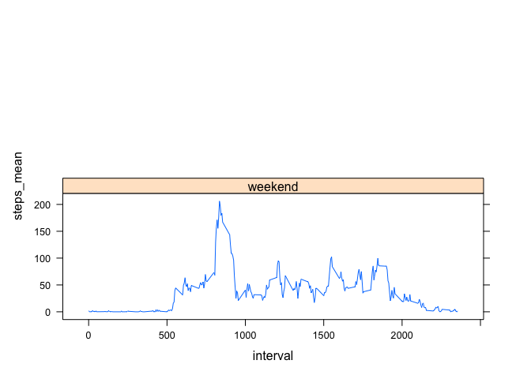

Reproducible Research: Peer Assessment 1
================
Carlos Guadián
12/2/2021

-   [Load & process data](#load--process-data)
-   [What is mean total number of steps taken per
    day?](#what-is-mean-total-number-of-steps-taken-per-day)
-   [What is the average daily activity
    pattern?](#what-is-the-average-daily-activity-pattern)
-   [Imputing missing values](#imputing-missing-values)
-   [Are there differences in activity patterns between weekdays and
    weekends?](#are-there-differences-in-activity-patterns-between-weekdays-and-weekends)

## Load & process data

First load data into `activity` variable

``` r
activity <- read.csv("~/RepData_PeerAssessment1/activity.csv")
```

Check for correct class of variables

``` r
str(activity)
```

    ## 'data.frame':    17568 obs. of  3 variables:
    ##  $ steps   : int  NA NA NA NA NA NA NA NA NA NA ...
    ##  $ date    : chr  "2012-10-01" "2012-10-01" "2012-10-01" "2012-10-01" ...
    ##  $ interval: int  0 5 10 15 20 25 30 35 40 45 ...

`date` variable has class character, and it has to be “Date”.

``` r
activity$date <- as.Date(activity$date)
```

Check again

``` r
str(activity)
```

    ## 'data.frame':    17568 obs. of  3 variables:
    ##  $ steps   : int  NA NA NA NA NA NA NA NA NA NA ...
    ##  $ date    : Date, format: "2012-10-01" "2012-10-01" ...
    ##  $ interval: int  0 5 10 15 20 25 30 35 40 45 ...

## What is mean total number of steps taken per day?

**Calculate the total number of steps taken per day**

To calculate the total number of steps taken per day first I have to
group data by day. To do this we need the `tidyverse` library.

``` r
library(tidyverse)
```

    ## ── Attaching packages ─────────────────────────────────────── tidyverse 1.3.1 ──

    ## ✓ ggplot2 3.3.5     ✓ purrr   0.3.4
    ## ✓ tibble  3.1.5     ✓ dplyr   1.0.7
    ## ✓ tidyr   1.1.4     ✓ stringr 1.4.0
    ## ✓ readr   2.0.2     ✓ forcats 0.5.1

    ## ── Conflicts ────────────────────────────────────────── tidyverse_conflicts() ──
    ## x dplyr::filter() masks stats::filter()
    ## x dplyr::lag()    masks stats::lag()

``` r
steps_by_day <- activity %>%
  group_by(date) %>%
  summarize(total_steps = sum(steps))
head(steps_by_day)
```

    ## # A tibble: 6 × 2
    ##   date       total_steps
    ##   <date>           <int>
    ## 1 2012-10-01          NA
    ## 2 2012-10-02         126
    ## 3 2012-10-03       11352
    ## 4 2012-10-04       12116
    ## 5 2012-10-05       13294
    ## 6 2012-10-06       15420

**Make a histogram of the total number of steps taken each day**

Making histogram with base system

``` r
with(steps_by_day, {
  hist(total_steps, col = "green", main = "Histogram total steps by day", xlab = "Total steps")
})
```


**Calculate and report the mean and median of the total number of steps
taken per day** Using two ways to get mean and median. With `summary`
and `mean()` & `median()`

``` r
summary(steps_by_day$total_steps)
```

    ##    Min. 1st Qu.  Median    Mean 3rd Qu.    Max.    NA's 
    ##      41    8841   10765   10766   13294   21194       8

``` r
mean(steps_by_day$total_steps, na.rm = TRUE)
```

    ## [1] 10766.19

``` r
median(steps_by_day$total_steps, na.rm = TRUE)
```

    ## [1] 10765

## What is the average daily activity pattern?

**Make a time series plot (i.e. type = “l”) of the 5-minute interval
(x-axis) and the average number of steps taken, averaged across all days
(y-axis)**

Group by interval to get average number of steps by interval

``` r
steps_by_interval <- activity %>%
  group_by(interval) %>%
  summarize(average_steps = mean(steps, na.rm = TRUE))
head(steps_by_interval)
```

    ## # A tibble: 6 × 2
    ##   interval average_steps
    ##      <int>         <dbl>
    ## 1        0        1.72  
    ## 2        5        0.340 
    ## 3       10        0.132 
    ## 4       15        0.151 
    ## 5       20        0.0755
    ## 6       25        2.09

Plotting time serie

``` r
with(steps_by_interval, {
plot(interval, average_steps, type = "l",
     main = "Average number of steps by 5 min. interval", xlab = "5 minutes Interval", ylab = "Average Steps", col = "blue", lwd = 1, frame.plot=FALSE, xaxt="n")
  axis(1, at = seq(00, 2355, by = 50), las=2)
  })
```


**Which 5-minute interval, on average across all the days in the
dataset, contains the maximum number of steps?** Getting the interval
filtering with `which.max()`

``` r
max_steps_interval <- steps_by_interval[which.max(steps_by_interval$average_steps),]
max_steps_interval
```

    ## # A tibble: 1 × 2
    ##   interval average_steps
    ##      <int>         <dbl>
    ## 1      835          206.

Adding vertical line to check if interval 835 has the maximum steps in
graph

``` r
with(steps_by_interval, {
plot(interval, average_steps, type = "l",
     main = "Average number of steps by 5 min. interval", xlab = "5 minutes Interval", ylab = "Average Steps", col = "blue", lwd = 1, frame.plot=FALSE, xaxt="n")
  axis(1, at = seq(00, 2355, by = 50), las=2)
  abline(v=835, col = "red", lwd = 1)
  })
```


## Imputing missing values

Note that there are a number of days/intervals where there are missing
values (**coded as NA**). The presence of missing days may introduce
bias into some calculations or summaries of the data.

**Calculate and report the total number of missing values in the dataset
(i.e. the total number of rows with NAs)** The only variable in
`activity` dataset with NAs is `steps`, we can check this with
`summary`, and then we can confirm with `sum(is.na())`

``` r
summary(activity)
```

    ##      steps             date               interval     
    ##  Min.   :  0.00   Min.   :2012-10-01   Min.   :   0.0  
    ##  1st Qu.:  0.00   1st Qu.:2012-10-16   1st Qu.: 588.8  
    ##  Median :  0.00   Median :2012-10-31   Median :1177.5  
    ##  Mean   : 37.38   Mean   :2012-10-31   Mean   :1177.5  
    ##  3rd Qu.: 12.00   3rd Qu.:2012-11-15   3rd Qu.:1766.2  
    ##  Max.   :806.00   Max.   :2012-11-30   Max.   :2355.0  
    ##  NA's   :2304

``` r
sum(is.na(activity$steps))
```

    ## [1] 2304

**Create a new dataset that is equal to the original dataset but with
the missing data filled in.**

**Devise a strategy for filling in all of the missing values in the
dataset. The strategy does not need to be sophisticated. For example,
you could use the mean/median for that day, or the mean for that
5-minute interval, etc.**

To replace NA we get the mean of each interval and then substitute the
NA for this new data.

``` r
library(dplyr)
# Create new dataset to fill NA values
intervals <- activity
# Groupping and replacing
intervals <- intervals %>%
  left_join(intervals %>%
              group_by(interval) %>%
              summarise(mean_steps = mean(steps, na.rm = TRUE))) %>%
  mutate(steps = ifelse(is.na(steps), mean_steps, steps)) %>%
  select(-mean_steps)
```

    ## Joining, by = "interval"

Check if the replace are OK

``` r
# First if there are NA values
summary(intervals)
```

    ##      steps             date               interval     
    ##  Min.   :  0.00   Min.   :2012-10-01   Min.   :   0.0  
    ##  1st Qu.:  0.00   1st Qu.:2012-10-16   1st Qu.: 588.8  
    ##  Median :  0.00   Median :2012-10-31   Median :1177.5  
    ##  Mean   : 37.38   Mean   :2012-10-31   Mean   :1177.5  
    ##  3rd Qu.: 27.00   3rd Qu.:2012-11-15   3rd Qu.:1766.2  
    ##  Max.   :806.00   Max.   :2012-11-30   Max.   :2355.0

``` r
sum(is.na(intervals$steps))
```

    ## [1] 0

**Make a histogram of the total number of steps taken each day**

To calculate the total number of steps taken per day first I have to
group data by day. To do this we need the `tidyverse` library.

``` r
steps_by_day_clean <- intervals %>%
  group_by(date) %>%
  summarize(total_steps = sum(steps))
head(steps_by_day_clean)
```

    ## # A tibble: 6 × 2
    ##   date       total_steps
    ##   <date>           <dbl>
    ## 1 2012-10-01      10766.
    ## 2 2012-10-02        126 
    ## 3 2012-10-03      11352 
    ## 4 2012-10-04      12116 
    ## 5 2012-10-05      13294 
    ## 6 2012-10-06      15420

Making histogram

``` r
with(steps_by_day_clean, {
  hist(total_steps, col = "green", main = "Histogram total steps by day without NA", xlab = "Total steps")
})
```


**Calculate and report the mean and median total number of steps taken
per day**

``` r
summary(steps_by_day_clean$total_steps)
```

    ##    Min. 1st Qu.  Median    Mean 3rd Qu.    Max. 
    ##      41    9819   10766   10766   12811   21194

``` r
mean(steps_by_day_clean$total_steps, na.rm = TRUE)
```

    ## [1] 10766.19

``` r
median(steps_by_day_clean$total_steps, na.rm = TRUE)
```

    ## [1] 10766.19

**Do these values differ from the estimates from the first part of the
assignment?**

Comparing two values

``` r
#comparing mean
identical(mean(steps_by_day$total_steps, na.rm = TRUE), mean(steps_by_day_clean$total_steps, na.rm = TRUE))
```

    ## [1] TRUE

``` r
# comparing median
identical(median(steps_by_day$total_steps, na.rm = TRUE),median(steps_by_day_clean$total_steps, na.rm = TRUE))
```

    ## [1] FALSE

**What is the impact of imputing missing data on the estimates of the
total daily number of steps?**

``` r
# Summarizing
# With NA
summary(steps_by_day)
```

    ##       date             total_steps   
    ##  Min.   :2012-10-01   Min.   :   41  
    ##  1st Qu.:2012-10-16   1st Qu.: 8841  
    ##  Median :2012-10-31   Median :10765  
    ##  Mean   :2012-10-31   Mean   :10766  
    ##  3rd Qu.:2012-11-15   3rd Qu.:13294  
    ##  Max.   :2012-11-30   Max.   :21194  
    ##                       NA's   :8

``` r
#Without NA
summary(steps_by_day_clean)
```

    ##       date             total_steps   
    ##  Min.   :2012-10-01   Min.   :   41  
    ##  1st Qu.:2012-10-16   1st Qu.: 9819  
    ##  Median :2012-10-31   Median :10766  
    ##  Mean   :2012-10-31   Mean   :10766  
    ##  3rd Qu.:2012-11-15   3rd Qu.:12811  
    ##  Max.   :2012-11-30   Max.   :21194

## Are there differences in activity patterns between weekdays and weekends?

For this part the `weekdays()` function may be of some help here. Use
the dataset with the filled-in missing values for this part.

Create a new factor variable in the dataset with two levels – “weekday”
and “weekend” indicating whether a given date is a weekday or weekend
day.

``` r
#create a vector of weekdays
weekdays1 <- c('Monday', 'Tuesday', 'Wednesday', 'Thursday', 'Friday')
#Use `%in%` and `weekdays` to create a logical vector
#convert to `factor` and specify the `levels/labels`
intervals$wDay <- factor((weekdays(intervals$date) %in% weekdays1), 
         levels=c(FALSE, TRUE), labels=c('weekend', 'weekday'))
```

**Make a panel plot containing a time series plot type = “l” of the
5-minute interval (x-axis) and the average number of steps taken,
averaged across all weekday days or weekend days (y-axis).**

Groupping by interval and wDay

``` r
weekday_vs_weekend <- intervals %>%
  group_by(interval, wDay) %>%
  summarise(steps_mean = mean(steps))
```

    ## `summarise()` has grouped output by 'interval'. You can override using the `.groups` argument.

Plotting panel to compare weedays with weekend

``` r
library(lattice)
xyplot(steps_mean ~ interval | wDay, data = weekday_vs_weekend, type = "l", layout = (c(1,2)))
```

<!-- -->
